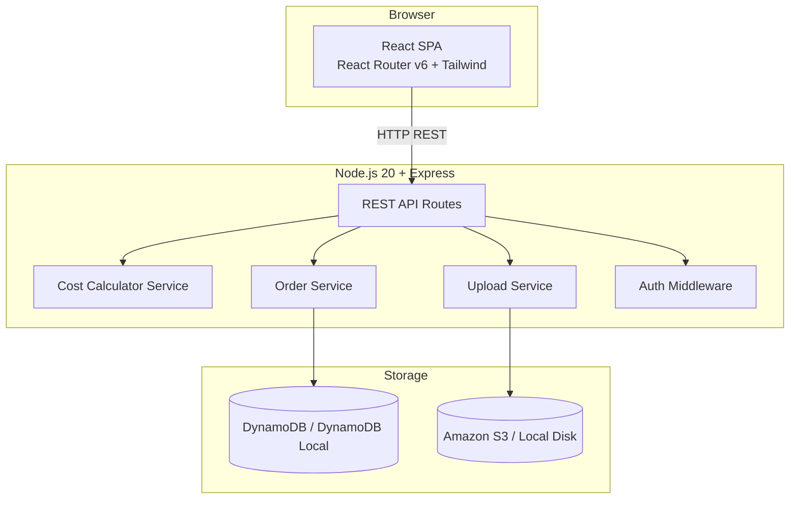

# Design Document — CampusPrint

## Overview

CampusPrint is a full-stack web application that digitizes the Xerox/stationery shop ordering workflow at a college campus. Students upload documents, configure printing options, receive a server-computed cost, simulate payment, and track order progress via polling. Staff log in to a protected dashboard where they manage the full order lifecycle.

The system is composed of three main parts:
1. A **React 18 SPA** (frontend), served as static assets
2. A **Node.js 20 + Express REST API** (backend)
3. **Amazon DynamoDB** (production data store) / **DynamoDB Local** (development)

File storage uses **Amazon S3** in production and a local-disk fallback in development, switched via `STORAGE_BACKEND` env var.

---

## Architecture



**Deployment topology (production):**
- React SPA served as static files (e.g., Nginx, S3+CloudFront, or from Express `static` middleware)
- Express backend in a Docker container on Amazon ECS
- DynamoDB as the managed data store
- Amazon S3 for file storage

**Development topology:**
- `docker-compose up` starts backend + DynamoDB Local
- `STORAGE_BACKEND=local` writes files to `./uploads/` on the container filesystem
- React dev server runs separately with `npm run dev` (Vite)

---

## Components and Interfaces

### Frontend Pages / Routes

| Route | Component | Description |
|---|---|---|
| `/` | `LandingPage` | Entry point — student vs staff buttons |
| `/order/new` | `NewOrderPage` | Multi-step form: upload → specs → cost preview → payment |
| `/order/:orderId` | `OrderTrackingPage` | Polls `/api/orders/:orderId` every 3 s; shows status + notification |
| `/my-orders` | `MyOrdersPage` | Student enters contact to list past orders |
| `/staff/login` | `StaffLoginPage` | Username/password form |
| `/staff/dashboard` | `StaffDashboardPage` | Sortable/filterable order table, paginated |
| `/staff/orders/:orderId` | `StaffOrderDetailPage` | Full detail, status update, rejection |

### Backend Modules

```
backend/
  src/
    routes/
      upload.js        # POST /api/upload
      orders.js        # all /api/orders routes
      auth.js          # POST /api/auth/login
    services/
      costCalculator.js   # pure cost formula
      orderService.js     # DynamoDB CRUD
      uploadService.js    # S3 / local-disk abstraction
    middleware/
      authMiddleware.js   # JWT/session check for staff routes
      errorHandler.js     # global Express error handler
      validateEnv.js      # startup env-var check
    db/
      dynamoClient.js     # DynamoDB Document Client factory
    app.js               # Express app setup
    server.js            # HTTP server entry point
```

### API Surface

| Method | Path | Auth | Description |
|---|---|---|---|
| `POST` | `/api/upload` | None | Upload document; returns `{ fileUrl }` |
| `POST` | `/api/orders` | None | Create order; returns `{ orderId, cost, order }` |
| `POST` | `/api/orders/:orderId/pay` | None | Simulate payment |
| `GET` | `/api/orders/:orderId` | None | Fetch single order |
| `GET` | `/api/orders?studentContact=` | None | Student order history |
| `GET` | `/api/orders?status=&search=` | Staff JWT | Full order queue (staff) |
| `PATCH` | `/api/orders/:orderId/status` | Staff JWT | Update status or reject |
| `POST` | `/api/auth/login` | None | Staff login; returns JWT |

---

## Data Models

### Order (DynamoDB `Orders` table)

```typescript
interface Order {
  orderId: string;              // PK — UUID v4, also serves as token
  studentName: string;
  studentContact: string;       // GSI partition key for history lookup
  fileName: string;
  fileUrl: string;
  printType: 'bw' | 'color';
  pages: number;                // >= 1
  copies: number;               // >= 1
  binding: 'none' | 'staple' | 'spiral';
  specialInstructions?: string;
  cost: number;                 // server-computed, ₹
  paymentStatus: 'pending' | 'paid';
  orderStatus: 'received' | 'processing' | 'ready' | 'collected' | 'rejected';
  estimatedCompletionTime?: string; // ISO 8601
  rejectionReason?: string;
  createdAt: string;            // ISO 8601
  updatedAt: string;            // ISO 8601
}
```

DynamoDB table design:
- **PK**: `orderId`
- **GSI**: `StudentContactIndex` — partition key `studentContact`, sort key `createdAt` (for history queries)

### Cost Calculation (pure function — no side effects)

```
cost(printType, pages, copies, binding):
  perPage = printType === 'color' ? 8 : 2
  bindingCost = binding === 'staple' ? 5 : binding === 'spiral' ? 20 : 0
  return pages * copies * perPage + bindingCost
```

### Environment Variables (`.env.example` excerpt)

```
PORT=3001
DYNAMODB_ENDPOINT=http://localhost:8000   # omit for production AWS DynamoDB
AWS_REGION=ap-south-1
AWS_ACCESS_KEY_ID=local
AWS_SECRET_ACCESS_KEY=local
DYNAMODB_TABLE_ORDERS=CampusPrint_Orders
DYNAMODB_TABLE_STUDENTS=CampusPrint_Students
STORAGE_BACKEND=local                     # 'local' | 's3'
S3_BUCKET_NAME=campusprint-uploads
LOCAL_UPLOAD_DIR=./uploads
JWT_SECRET=changeme
STAFF_USERNAME=admin
STAFF_PASSWORD=changeme
FRONTEND_URL=http://localhost:5173
```

---

## Correctness Properties

*A property is a characteristic or behavior that should hold true across all valid executions of a system — essentially, a formal statement about what the system should do. Properties serve as the bridge between human-readable specifications and machine-verifiable correctness guarantees.*

### Property 1: Cost calculation is deterministic and formula-correct

*For any* valid combination of `printType` ∈ {`bw`, `color`}, `pages` ≥ 1, `copies` ≥ 1, and `binding` ∈ {`none`, `staple`, `spiral`}, the `costCalculator` function SHALL return `pages × copies × (printType === 'color' ? 8 : 2) + (binding === 'staple' ? 5 : binding === 'spiral' ? 20 : 0)`.

**Validates: Requirements 2.2**

---

### Property 2: Order JSON serialization round-trip

*For any* valid `Order` object, serializing it to JSON with the pretty-printer and then deserializing the result SHALL produce an object deeply equal to the original in all fields.

**Validates: Requirements 11.1, 11.3**

---

### Property 3: Invalid order inputs are always rejected

*For any* order creation request where `pages < 1`, `copies < 1`, or a required field is missing, the order creation service SHALL return a validation error and SHALL NOT persist an order record.

**Validates: Requirements 2.3**

---

### Property 4: Payment idempotency / state guard

*For any* order with `paymentStatus === 'paid'`, calling the payment endpoint again SHALL return an error and SHALL NOT mutate the order.

**Validates: Requirements 3.3**

---

### Property 5: Staff status transitions are strictly enforced

*For any* order, the status update service SHALL only permit the transitions `received → processing`, `processing → ready`, `ready → collected`, and `any → rejected`. Any other requested transition SHALL return an error without persisting any change.

**Validates: Requirements 7.1, 7.5**

---

### Property 6: Processing gate — payment must be confirmed

*For any* order whose `paymentStatus` is `pending`, attempting to transition `orderStatus` to `processing` SHALL return an error and SHALL NOT update the order.

**Validates: Requirements 7.2**

---

### Property 7: Rejection requires a non-empty reason

*For any* rejection request, if the `rejectionReason` field is absent or composed entirely of whitespace, the system SHALL return an error and SHALL NOT set `orderStatus` to `rejected`.

**Validates: Requirements 7.3**

---

### Property 8: Uploaded file URL is stable and retrievable

*For any* file uploaded via `POST /api/upload`, the returned `fileUrl` SHALL be a non-empty string that, when stored on an order, can later be retrieved as part of the order record unchanged.

**Validates: Requirements 1.4**

---

## Error Handling

All errors follow a common JSON shape:

```json
{ "message": "Human-readable description", "field": "optionalFieldName" }
```

- `400` — validation failures (missing fields, bad values, invalid transitions, already paid)
- `401` — unauthenticated staff requests
- `404` — order not found
- `500` — unexpected server errors (message is generic to client; full error is logged server-side)

The global `errorHandler` middleware in Express catches any unhandled errors thrown by route handlers and formats them into the above shape, ensuring no uncaught exception can crash the process.

Startup validation (`validateEnv.js`) checks all required ENV keys before binding to a port; if any are missing it prints a list of missing keys and calls `process.exit(1)`.

---

## Testing Strategy

### Property-Based Testing Library

**Backend:** [`fast-check`](https://github.com/dubzzz/fast-check) (JavaScript/TypeScript PBT library). Each property test runs a minimum of **100 iterations**.

**Frontend:** React Testing Library + Vitest for unit/integration tests.

### Tagging Convention

Every property-based test MUST be annotated with:

```
// Feature: campus-print, Property {N}: {property_text}
```

### Unit Tests

- `costCalculator.test.js` — specific examples: zero binding, staple, spiral, color vs bw
- `orderService.test.js` — CRUD stubs against DynamoDB Local
- `authMiddleware.test.js` — valid/invalid JWT scenarios
- `validateEnv.test.js` — missing variable detection

### Property-Based Tests (fast-check)

Each correctness property maps to exactly one `fc.assert(fc.property(...))` block:

| Test file | Property | Iterations |
|---|---|---|
| `costCalculator.property.test.js` | Property 1 | 500 |
| `orderSerialization.property.test.js` | Property 2 | 200 |
| `orderValidation.property.test.js` | Property 3 | 200 |
| `payment.property.test.js` | Property 4 | 200 |
| `statusTransition.property.test.js` | Properties 5 & 6 | 200 |
| `rejection.property.test.js` | Property 7 | 200 |
| `upload.property.test.js` | Property 8 | 100 |

### End-to-End Flow Test

A scripted smoke test (using `supertest` against the running Express app + DynamoDB Local) exercises the full happy path:

1. `POST /api/upload` → get `fileUrl`
2. `POST /api/orders` → get `orderId` + `cost`
3. `POST /api/orders/:orderId/pay`
4. `POST /api/auth/login` → get staff JWT
5. `GET /api/orders` (staff) → confirm order appears
6. `PATCH /api/orders/:orderId/status` → `processing`
7. `PATCH /api/orders/:orderId/status` → `ready`
8. `GET /api/orders/:orderId` → confirm `ready`
9. `PATCH /api/orders/:orderId/status` → `collected`
